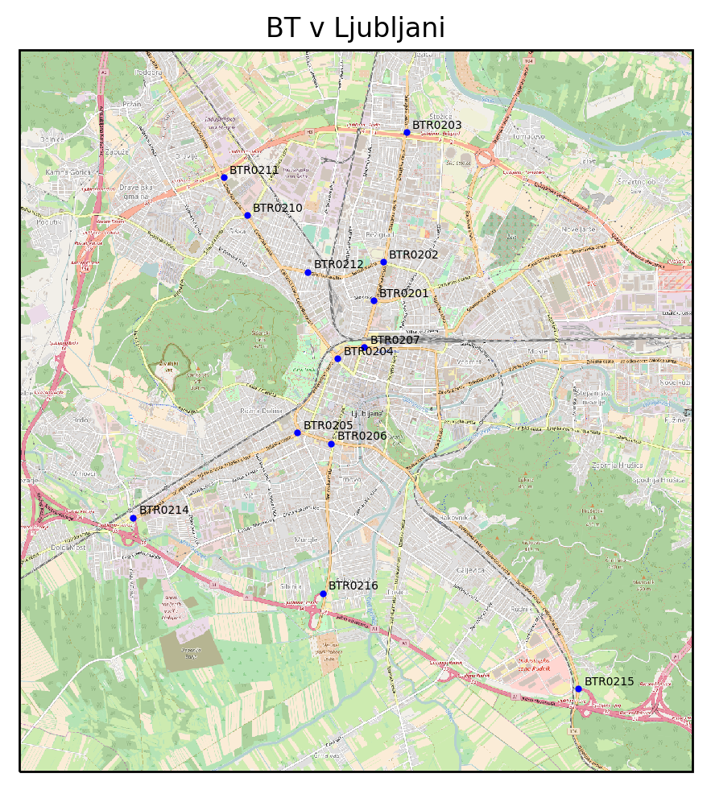
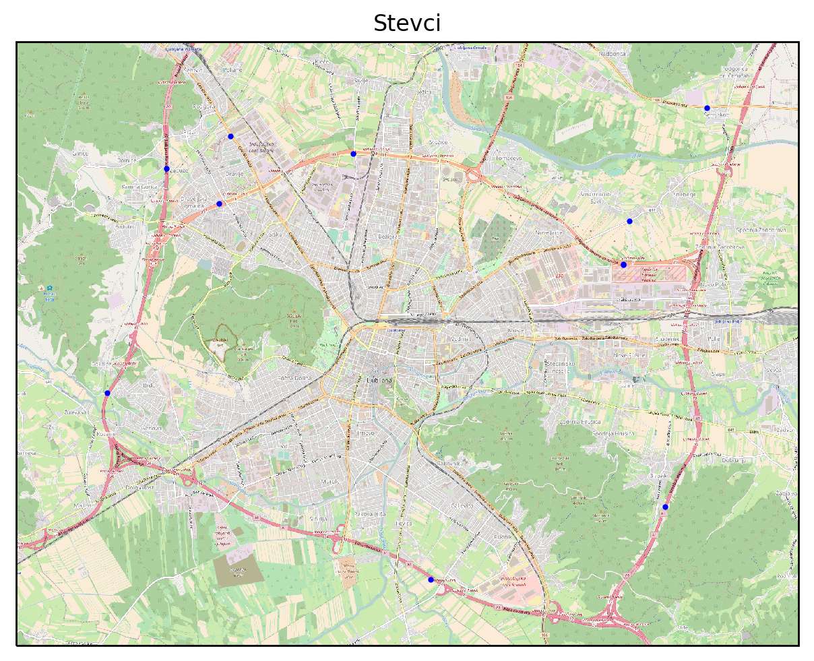
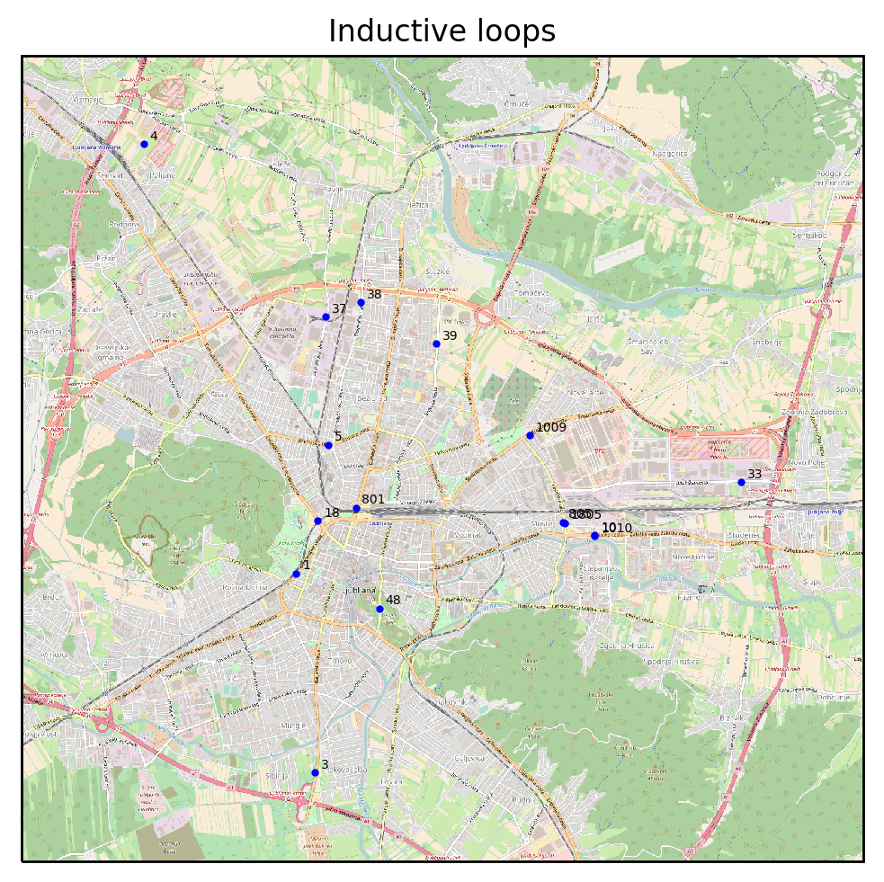

## Collectors

Here are all collectors for scraping data from different sources and
forwarding it the data in json format to Apache Kafka. The main scripts 
have kafka in their names. There are also some other files for which 
purposes reference the readme.

For running the scripts you need some additional python modules which 
you can install using pip:

```
pip install --upgrade pip
pip install -r requirements.txt
```

and for ploting scripts:

```
pip install -r requirements-plot.txt
```

Additionally you have to set some environment variables or have a 
`local_settings.py` file. All settings can be found in `settings.py` 
Set at least those variables:
```
export KAFKA_HOST=host
export KAFKA_PORT=port
export TIMON_USERNAME=user
export TIMON_PASSWORD=password
```

Every collector forwards his data to his unique Kafka topic. A Kafka 
connector then takes those json messages and inserts them into Cassandra
[tables](../virtual_machines/cassandra_vm/tables.cql).

|      Collector     |    Kafka topic   | Cassandra table |
|:------------------:|:----------------:|:---------------:|
|  Bluetooth sensors |      bt_json     |    bt_sensors   |
|  Traffic counters  |   counter_json   |     counters    |
|   Inductive loops  |  inductive_json  | inductive_loops |
|  LPP stations data | lpp_station_json |   lpp_station   |
| LPP static arrival |  lpp_static_json |    lpp_static   |
|  LPP live arrival  |   lpp_live_json  |     lpp_live    |
|    Air pollution   |  pollution_json  |    pollution    |


### Bluetooth sensors

On some traffic lights in Ljubljana there are bluetooth sensors. They
collect ids of bluetooth devices that drive near them. If the same
device is detected on a different locations the average speed can be
calculated based on the distance and travel time. The data is generously
provided by the [Timon project](https://gitlab-timon.xlab.si/).

**Data source:**
https://datacloud-timon.xlab.si/data_access/

**JSON data:**
```json
{
  "id": "58b7eca0c0a6834de255eb5c",
  "fromBtId": "BTR0201",
  "fromBtLng": 14.50808,
  "fromBtLat": 46.06354,
  "toBtId": "BTR0202",
  "toBtLng": 14.50978,
  "toBtLat": 46.06826,
  "distance": 500,
  "allCount": 31,
  "avgSpeed": 46.015692307692305,
  "avgTravelTime": 0.015192307692307698,
  "count": 26,
  "timestampFrom": "2017-03-02T10:35:00+01:00",
  "timestampTo": "2017-03-02T10:50:00+01:00"
}
```

**Image of sensors location:**


### Traffic counters

The data is similar to inductive loops except for the location which is
on Ljubljana highway ring and outside the ring. This data is publicly
available at opendata Slovenia.

**Data source:**
https://opendata.si/promet/counters/

**JSON data:**
```json
{
  "id": "0178-21",
  "Title": "AC-A1, LJ (južna obvoznica)",
  "Description": "AC-A1, LJ (južna obvoznica)",
  "stevci_lokacijaOpis": "LJ (južna obvoznica)",
  "stevci_cestaOpis": "AC-A1",
  "stevci_smerOpis": "Barjanska - Peruzzijeva",
  "stevci_pasOpis": "(v)",
  "x_wgs": 14.51818035950113,
  "y_wgs": 46.01962915242322,
  "CrsId": "EPSG:2170",
  "Y": 97385.0,
  "X": 463074.0,
  "stevci_statOpis": "Zgoščen promet",
  "stevci_stev": 1056,
  "stevci_hit": 95,
  "stevci_gap": 3.0,
  "stevci_stat": 3,
  "ContentName": "stevci",
  "Icon": "res/icons/stevci/stevec_3.png",
  "modified": "2017-03-03T10:19:14.272Z",
}
```

**Image of counters location:**


### Inductive loops

The data is similar to traffic counters except for the location which is
mostly inside Ljubljana highway ring. The data is generously provided by
the [Timon project](https://gitlab-timon.xlab.si/).

**Data source:**
http://10.30.1.132:9200/_plugin/hq/

**WARNING:**
Source is located on Arcture Openstack. You need to connect with OpenVPN.
More information on [wiki](https://wiki.xlab.si/robert_plestenjak/openstack-arctur).

**JSON data:**
```json
{
  "id": "0018-11",
  "title": "-, Celovška cesta : Tivolska cesta - Ruska ul. (r)",
  "region": "Ljubljana",
  "location": 18,
  "locationDescription": "Celovška cesta",
  "deviceX": 46.057694,
  "deviceY": 14.500324,
  "point": "46,057694 14,500324",
  "direction": 11,
  "directionDescription": "Tivolska cesta - Ruska ul.",
  "laneDescription": "(r)",
  "roadSection": "-",
  "roadDescription": "-",
  "StatusDescription": "Normal traffic",
  "numberOfVehicles": 444,
  "gap": 7.3,
  "vmax": 50,
  "avgSpeed": 61,
  "occ": 56,
  "chainage": 0,
  "stat": 1,
  "time": "11:00:00",
  "date": "02/03/2017",
  "pkgdate": "2017-03-02T10:00:19Z",
  "updated": "2017-03-02T10:00:00Z"
}
```

**Image of inductive loops location:**


### LPP traffic

LPP company runs the city bus traffic in Ljubljana. They have stations
all over the city. Their data is collected combined with station static
arrival time. Those arrival times are predicted in advance by LPP if
there is no traffic. But because this is not the case one can also get
live prediction on arrival data. The data is generously provided by the
Timon project.

**Data source:**
http://jozefstefaninstitute.github.io/LPPServer/

#### LPP live arrival

**JSON data:**
```json
{
  "station_int_id": 2097,
  "route_int_id": 1564,
  "arrival_time": "2017-03-02 11:15:33.000"
}
```


#### LPP static arrival

**JSON data:**
```json
{
  "station_int_id": 3261,
  "route_int_id": 911,
  "arrival_time": "2017-03-02T21:13:00.000Z"
}
```


#### LPP stations data

**JSON data:**
```json
{
  "station_int_id": 4236,
  "station_name": "Na Žale",
  "station_direction": "",
  "station_ref_id": 203232,
  "station_lat": 46.0716188375998,
  "station_lng": 14.529913754516,
  "route_int_id": 1579,
  "route_num": 19,
  "route_num_sub": "B",
  "route_name": "TOMAČEVO",
  "scraped": "2017-03-10T00:00:00+00:00"
}
```

### Air pollution

Data about air pollution collected on Bežigrad and Vošnjakova-Tivolska
in Ljubljana. They have slightly different data. The result is that the
json is a combination of both formats and will contain some null fields.

**Data source:**
http://www.ljubljana.si/si/zivljenje-v-ljubljani/okolje-prostor-bivanje/stanje-okolja/zrak/

**JSON data:**
```json
{
  "location": "bezigrad",
  "co": 0.48,
  "no": 52.3,
  "no2": 44.5,
  "nox": 124.45,
  "pm": 44.33,
  "so2": 9.7,
  "solar_radiation": 172,
  "temperature": 4.3,
  "pressure": 979.5,
  "humidity": 84,
  "windspeed": 1.1,
  "wind_direction": "SV",
  "paraxylene": 4.0,
  "benzene": 2.0,
  "tolulene": 4.0,
  "hour": "16:00",
  "scraped": "2017-03-09T16:00:00"
}
```